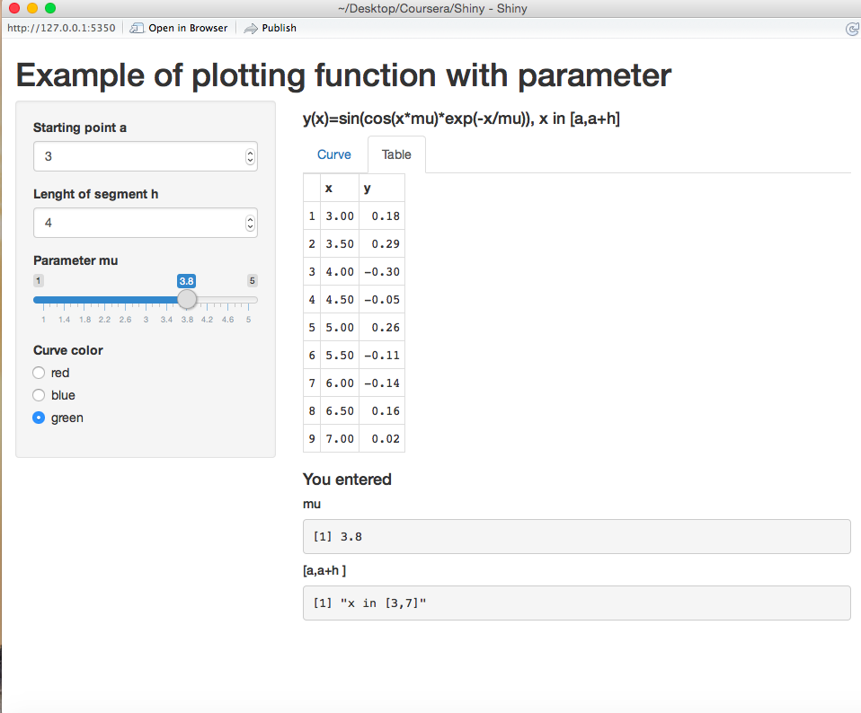

Statement of the Problem
========================================================

It is necessary to draw the graph and to show the table for function (the parameters are set by user)

$y(x)=\sin(\cos(x \mu) \exp(-x/ \mu)),$
$x \in [a,b], b=a+h.$

Main Steps:

- To choose $a, h, \mu$

- To choose curve color

- To study the behavior of function withdifferent parameters


Example of the Plot without Shiny 
========================================================

```{r}
mu <- 3; a<-2; h<-3; color="red"
curve(sin(cos(mu*x)*exp(-x/mu)),a, a+h, n = 1001, 
      col=color, ylab="y(x)")
```

Example of the Table without Shiny 
========================================================

```{r}
 x=seq(a,a+h,by=0.5); y=sin(cos(mu*x)*exp(-x/mu))
 data.frame(x,y)
```

Example of the Plot the with Shiny 
====================================


Example of the Table with Shiny
====================================


File ui.R 
====================================
```{r,eval=FALSE}
hinyUI(pageWithSidebar(
    headerPanel("Example of plotting function with parameter"),
  
    sidebarPanel(
              
        numericInput('a', 'Starting point a', 0, min = 0, max = 10),
        numericInput('h', 'Lenght of segment h', 1, min = 1, max = 10),
       
        sliderInput('mu', 'Parameter mu',
                    value = 2, min = 1, max = 5, step = 0.05),
        radioButtons('color', 'Curve color',
                    choices =   c("red", "blue", "green"))
    ),
    mainPanel(
        h4('y(x)=sin(cos(x*mu)*exp(-x/mu)), x in [a,a+h]'),
        tabsetPanel(
        tabPanel("Curve",plotOutput('myPlot')),
        tabPanel("Table", tableOutput("table"))
        ),
        h4('You entered'),
        h5('mu'),
        verbatimTextOutput("mu"),
        h5(' [a,a+h ] '),
        verbatimTextOutput("a_h")
    )
))

```


File server.R
====================================
```{r,eval=FALSE}
library(shinyapps)

# Function with parameter
fun <- function(x,mu) 
    sin(cos(mu*x)*exp(-x/mu))

shinyServer(
    function(input, output) {
        # Generate function plot   
        output$myPlot <- renderPlot({
            mu <- input$mu
            a<-input$a
            h<-input$h
            curve(fun(x,mu), a, a+h, n = 1001, 
                  col=input$color, ylab="y(x)")
           })
    
    # Generate echo of user input
    output$mu <- renderPrint({input$mu})
    output$a_h <- renderPrint(paste0("x in [",{input$a},",",{input$a}+{input$h},"]"))
   
    # Generate table view of the function value
    output$table <- renderTable({
    mu <- input$mu
    a<-input$a
    h<-input$h
    x=seq(a,a+h,by=0.5)
    y=fun(x,mu)
    data.frame(x,y)
    })
})
  
```

