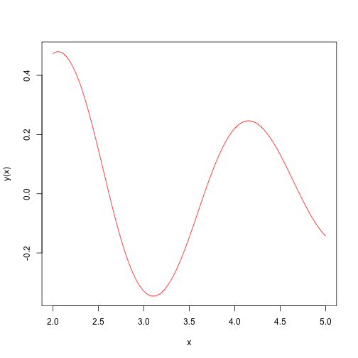
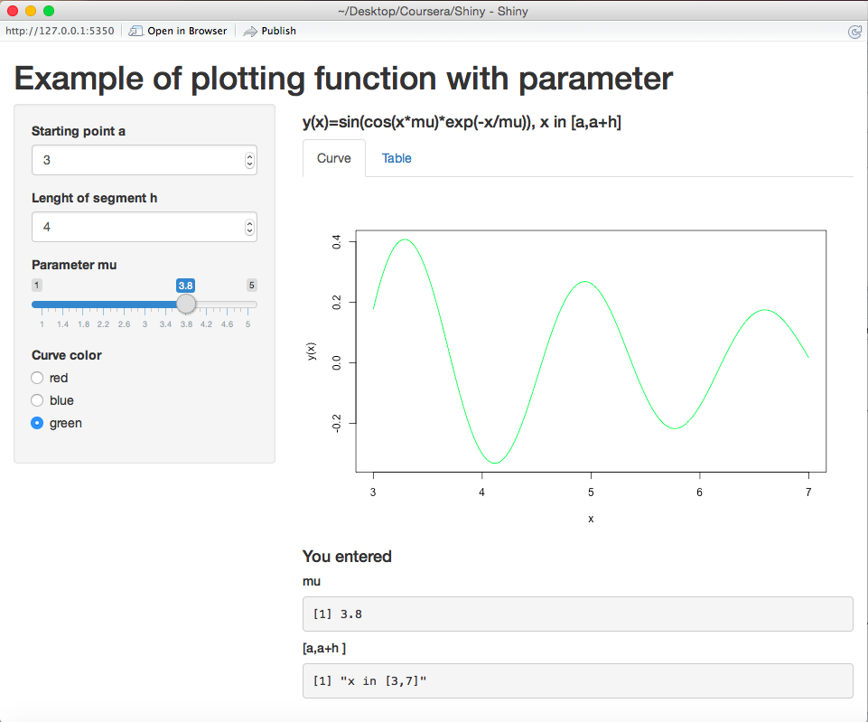
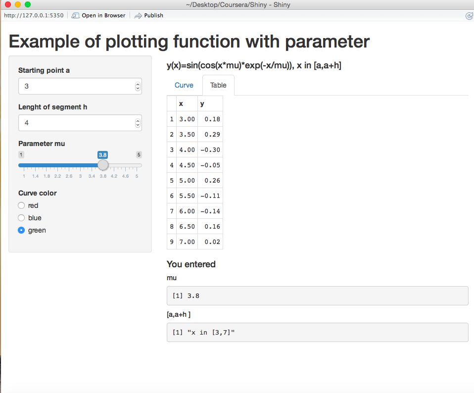

Dinamic Plot and Table for Function with Parameter
========================================================
author: Tetyana
date: Tue Aug 11 18:17:47 2015
width: 1000
height: 600
#autosize: true

Statement of the Problem
========================================================

It is necessary to draw the graph and to show the table for function (the parameters are set by user)

$y(x)=\sin(\cos(x \mu) \exp(-x/ \mu)),$
$x \in [a,b], b=a+h.$

Main Steps:
- To choose $a, h, \mu$
- To choose curve color
- To study the behavior of function withdifferent parameters


Example of the Plot without Shiny 
========================================================


```r
mu <- 3; a<-2; h<-3; color="red"
curve(sin(cos(mu*x)*exp(-x/mu)),a, a+h, n = 1001, 
      col=color, ylab="y(x)")
```

 

Example of the Table without Shiny 
========================================================


```r
 x=seq(a,a+h,by=0.5); y=sin(cos(mu*x)*exp(-x/mu))
 data.frame(x,y)
```

```
    x          y
1 2.0  0.4732425
2 2.5  0.1500779
3 3.0 -0.3289449
4 3.5 -0.1475431
5 4.0  0.2206077
6 4.5  0.1323552
7 5.0 -0.1429947
```

My Shiny Application
====================================

***

